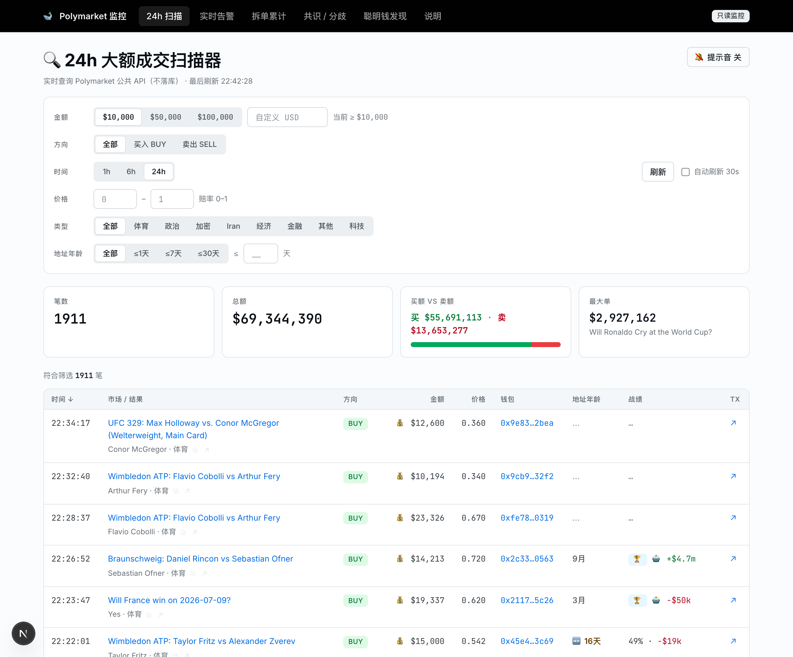
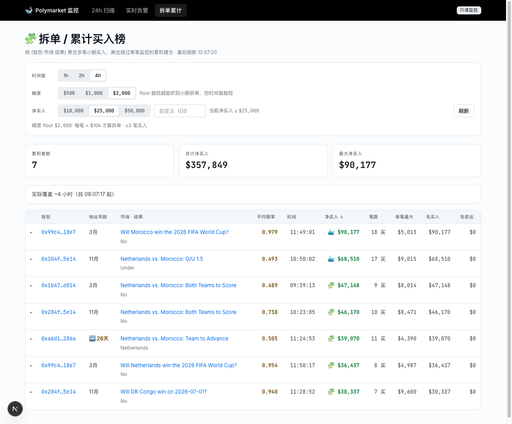
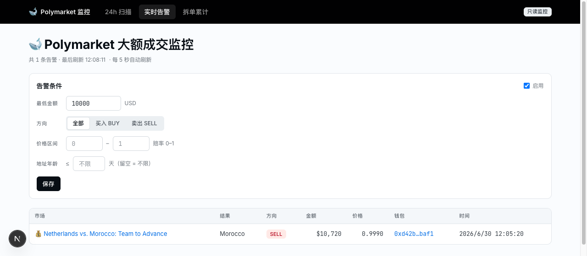

<div align="center">

# 🐳 Polymarket WhaleWatch

**Real-time monitoring for large trades, split-buy accumulation, fresh-wallet activity, and smart-money consensus on [Polymarket](https://polymarket.com) prediction markets — with a built-in validation loop that tells you whether the signals were any good.**

[](https://www.typescriptlang.org/)
[](https://nextjs.org/)
[](https://nodejs.org/)
[](https://www.sqlite.org/)


[](https://github.com/kydlikebtc/polymarket-whalewatch/commits/main)
[](https://github.com/kydlikebtc/polymarket-whalewatch/stargazers)



<sub>The 24h scanner filtered to <code>$100k+</code> buys — whale fills across markets with live address-age badges (<code>🆕</code> flags fresh wallets, some only days old) and per-row odds. Layer on the insider-hunt combo (price <code>0.5–0.9</code> + address age <code>≤7天</code>) to collapse the firehose down to suspicious fresh-wallet money.</sub>

</div>

---

A whale on Polymarket rarely announces themselves. They split a big position into many small orders, use freshly-created wallets, and buy at favorable odds. **WhaleWatch surfaces exactly that** — a 7×24 worker that pushes large fills to Telegram, plus a web dashboard to hunt the patterns single-trade alerts miss.

> **中文简介**：监控 Polymarket 上的大额成交、拆单建仓、新钱包行为和**聪明钱共识**。后台 worker 实时把大单推送到 Telegram（🏆 标注高胜率白名单钱包，白名单每日自动从官方盈利榜播种）；网页看板可按金额 / 买卖 / 价格(赔率) / 地址年龄筛选，每行自带**已结算战绩徽章**（胜率 · 已实现盈亏），点击任意地址进入**钱包档案页**（赔率带直方图 / 专攻类别 / 拆单倾向）。当 ≥2 个白名单钱包同向买入同一结果时触发**共识告警**。**验证闭环**自动回填每条告警信号后 1h/24h 的价格走势与最终结算结果——直接回答"这些信号到底准不准"。全站图标（💰🐳🧩🆕🏆🔥✅❌➖📐）**鼠标悬停即出解释**，`/glossary` 说明页收录所有符号与名词定义。全程只查询公开 API，不归档成交流水。

> ⚠️ Research / monitoring tool only. Uses **public** Polymarket data — no authentication, no trading. Not financial advice.

---

## ✨ At a glance

|     | Capability                | What it catches                                                         |
| :-: | :------------------------ | :---------------------------------------------------------------------- |
| 🔔  | **Large-trade alerts**    | Big executed fills, pushed to Telegram in seconds                       |
| 🧩  | **Split-buy detection**   | Positions built from many small sub-threshold orders                    |
| 🆕  | **Fresh-wallet flagging** | Address lifespan + new-wallet badges on every row                       |
| 🎯  | **Insider-hunt filters**  | New wallet **＋** favorable odds **＋** pre-settlement rush             |
| 🏆  | **Smart-money whitelist** | Auto-seeded daily from the official profit leaderboards, 🏆-tagged live |
| 🔥  | **Consensus detection**   | ≥N whitelist wallets independently buying the SAME outcome              |
| 📈  | **Track-record badges**   | Settled win-rate · realized PnL on every wallet, plus a full dossier    |
| 📐  | **Validation loop**       | 1h/24h follow-through + settlement result on every alert it fired       |

---

## 🚀 Features

### 🔔 Large-trade alerts (worker)

- Polls the public Polymarket trades feed every few seconds and pushes **rich Telegram alerts** for fills above a USD threshold (tiered, e.g. `💰 ≥$10k`, `🐳 ≥$50k`).
- Every alert is **context-enriched via the Gamma API**: `占24h量 18% · 流动性 $229k · 距结算 5h` — a $15k fill into a $30k/day market means far more than $100k into the election main market.
- **Cold-start seeding** silently marks the existing backlog as seen on first launch, so you don't get blasted with hundreds of historical trades.
- Persistent dedup (SQLite, unique-indexed) — a restart never replays or skips an alert.
- Resilient: retries transient API timeouts; transient Gamma failures **defer** (never swallow) matching trades; process-level guards for 7×24 uptime.

### 🏆 Smart-money whitelist + live tagging

- Seeded **daily and automatically** from the official profit leaderboards (WEEK / MONTH / ALL, merged per wallet; volume-0 holding accounts dropped; stale wallets age out after 30 days; manual whitelist entries are permanent).
- Top earners get a **settled track-record enrichment** from `/closed-positions` — win rate, realized PnL, ROI — feeding an explainable 0-100 score (profit 40 + capital efficiency 30 + win rate 30).
- The alert engine cross-checks every fill against the whitelist in real time: 🏆 prefix on Telegram, `type='smart'` in history, plus a **smart-only alert mode**.

### 🔥 Consensus detection (聪明钱共识)

Two or three unrelated high-win-rate wallets independently buying the **same outcome** beats any single whale fill. A 5-minute worker loop scans a 6h window and pushes `🔥 聪明钱共识` when ≥N whitelist wallets each net-buy ≥$X of one outcome — alerting only on **formation and escalation** (a third wallet joining), never repeats. The `/consensus` board shows every live group with the smart-money entry price vs the current price (**仍可跟 +1.2¢** / 已跑).

### 📊 Web dashboard (Next.js)

- **24h Scanner** — every large fill in a rolling window. Filter by **amount**, **buy/sell**, **time window (1h/6h/24h)**, **price band (odds)**, and **address age**; sort by time or amount. Live, no database.
- **Track-record badges (战绩)** — every wallet row shows its settled win rate and realized PnL (`72% · +$38k`), computed from `/closed-positions` and cached for a day. Same badge on the accumulation board.
- **Wallet dossier (`/wallet/<address>`)** — click any address: age, win rate/ROI, category focus, **odds-band histogram**, split-buy tendency (share of sub-$1k buys), this tool's own alert history for the wallet, recent trades. One click replaces ten minutes of block-explorer digging.
- **Split-buy accumulation board (拆单累计买入榜)** — aggregates trades by `(wallet, market, outcome)` and ranks by **NET buy-in**, catching wallets that build a large position through many sub-threshold orders. In live testing, single-trade monitoring missed **~60%** of ≥$10k accumulators.
- **Alert history + validation (📐)** — every fired alert shows the market price **1h/24h after the signal** (direction-colored ¢ deltas) and the final settlement result (✅/❌/➖ for 50-50 pushes), plus a live strip: _24h direction hit-rate · settled win-rate_. Computed on demand from public history — the tool grades its own signals.
- **Address age on every wallet** — lifespan since the wallet's first Polymarket activity, badged `🆕` for new addresses (hours/minutes under a day, exact days ≤30d). Permanently cached.
- **Built-in glossary (`/glossary`)** — every symbol (💰 🐳 🧩 🆕 🏆 🔥 ✅ ❌ ➖ 📐) and term (冲击占比 · 跟单空间 · 评分构成 · 内幕猎杀组合 …) is documented on a reference page, **and hovering any icon anywhere in the dashboard shows the same explanation** — tooltips and the docs page share one data source (`app/glossary.ts`), so they can never drift apart.

### 🎯 The insider-hunt combo

Abnormal insider-information money tends to **buy at favorable odds using relatively new wallets, close to settlement**. Set the scanner to **price `0.5–0.9` + address age `≤7天`** and the firehose collapses to a short list of exactly that signature; the alert engine adds a **距结算 ≤N 小时** condition to catch the pre-settlement rush.

### 🔍 Query-only by design

No trade-feed archival. Wallet history, track records, price history, and settlements are all **queried on demand** from Polymarket's public APIs (`/closed-positions`, `/activity`, `/prices-history`, Gamma) — the SQLite file holds only rebuildable caches and tiny dedup state. Delete it and the system rebuilds itself.

---

## 📸 More views

<table>
<tr>
<td width="50%" valign="top">

<br><sub><b>Split-buy accumulation board</b> — wallets ranked by <b>NET buy-in</b>, with size-weighted average odds, address age, and per-row time. Expand any row to see the underlying sub-threshold orders that built the position.</sub>
</td>
<td width="50%" valign="top">

<br><sub><b>Configurable alert engine</b> — set amount / side / price band / address-age conditions right in the dashboard; the embedded worker records every match to SQLite and (optionally) pushes it to Telegram.</sub>
</td>
</tr>
</table>

---

## ⚡ Quick start

Requirements: **Node 20+**.

```bash
npm install

# Web dashboard → http://localhost:3000
# (set PORT in .env — or `PORT=8080 npm run dev` — to change the port)
npm run dev

# Run tests
npm run test

# Zero-credential live smoke test of the whole pipeline (no Telegram needed)
npx tsx scripts/dry-run.ts

# Live console monitor (no credentials; prints alerts instead of Telegram)
npx tsx scripts/watch.ts
```

### Enable Telegram alerts (worker)

```bash
cp .env.example .env
# edit .env:
#   TELEGRAM_BOT_TOKEN=...               (from @BotFather)
#   TELEGRAM_CHANNEL_ID=@yourchannel     (bot must be an admin of the channel)
#   LARGE_THRESHOLDS=10000,50000
#   POLL_INTERVAL_MS=4000

npx tsx scripts/test-telegram.ts   # send a test message
npm run worker                     # start the 7×24 worker
```

---

## 🧠 How it works

- **Data source** — Polymarket public Data API (`data-api.polymarket.com`) + Gamma API (`gamma-api.polymarket.com`) + CLOB price history (`clob.polymarket.com/prices-history`). No auth, no keys.
- **Scanner fetch strategy** — the API times out (HTTP 408, ~5.75s) on expensive high-`filterAmount` queries, so the dashboard always fetches at a **fast low floor** and applies the higher amount / side / price / age filters **client-side**. Switching filters is instant.
- **Address age** — `GET /activity?user=<wallet>&sortDirection=ASC&limit=1` → the oldest activity timestamp ≈ the wallet's "birth" on Polymarket. Cached forever in SQLite (`wallet_age`).
- **Track records** — `GET /closed-positions?user=` returns every settled position with `realizedPnl`. Careful: `totalBought` is **shares**, not USD — cost basis is `totalBought × avgPrice` (verified against live PnL to the cent).
- **Leaderboard quirks (verified live)** — `rank` comes back as a string, pages clamp at 50 rows, deep offsets silently re-serve the same rows (wallet-dedup is the only reliable termination), and `pnl` is mark-to-market — which is why final scoring re-derives from settled positions.
- **Validation** — past prices are immutable, so 1h/24h follow-through is fetched once from `/prices-history` and cached permanently; settlements come from Gamma `closed/outcomePrices` (closed-market metadata never expires).
- **Worker ≠ dashboard** — the worker is the _stateful, alerting_ path (writes SQLite, pushes Telegram); the dashboard is the _stateless, exploratory_ path (reads the live API). They're decoupled through SQLite.

Design notes and the runtime-verification checklist live in [`docs/plans/`](docs/plans).

---

## 🗂️ Project structure

```
lib/        shared core — Polymarket/Telegram clients, types, SQLite, pure logic
  polymarket.ts    trades feed (getLargeTrades / getTradesWindow, retry + validation)
  accumulate.ts    split-buy aggregation (pure)
  walletAge.ts     first-activity lookup + SQLite cache
  walletStats.ts   settled track record from /closed-positions (win rate · PnL · ROI)
  walletProfile.ts recent-activity analysis (odds bands · market focus · split tendency)
  leaderboard.ts   official profit-leaderboard client (clamp/dedup aware)
  smartWallets.ts  daily whitelist seeding + scoring + live tag lookup
  consensus.ts     smart-money consensus detection + state-deduped alerting
  gamma.ts         market metadata (volume/liquidity/endDate/resolution) + cache
  priceHistory.ts  CLOB prices-history point lookup
  alertOutcomes.ts per-alert 1h/24h follow-through + settlement backfill
  alertEngine.ts / alert.ts / alertConditions.ts
  seen.ts / poll.ts / trades.ts / db.ts / config.ts / telegram.ts / mapLimit.ts
worker/     7×24 polling worker (4s alert cycle + 5min consensus loop + daily seed)
app/        Next.js dashboard
  page.tsx                24h scanner (+ price/age filters, track-record badges)
  accumulation/page.tsx   split-buy ranking board
  consensus/page.tsx      smart-money consensus board (entry vs current price)
  alerts/page.tsx         alert history + validation column + conditions panel
  wallet/[address]/page.tsx  wallet dossier
  glossary/page.tsx       icon & term reference (same source as hover tooltips)
  glossary.ts             single source of truth for every symbol/term
  api/{scan,accumulation,consensus,wallet-age,wallet-stats,alert-outcomes,alerts,alert-config}/route.ts
  api/wallet/[address]/route.ts
scripts/    dry-run.ts · watch.ts · test-telegram.ts
docs/plans/ design + implementation docs
```

**Stack:** TypeScript · Next.js 16 · better-sqlite3 · zod · vitest · 110 unit tests.

---

## 🗺️ Roadmap

- [x] Large-trade Telegram alerts (worker)
- [x] 24h scanner with amount / side / time / **price** / **address-age** filters
- [x] Split-buy accumulation detection (dashboard)
- [x] Wallet-age annotation with new-address badges
- [x] Smart-money whitelist (daily leaderboard seed → settled win-rate/ROI scoring → live 🏆 tagging)
- [x] Smart-money **consensus** detection + board + push alerts
- [x] Wallet track-record badges + full dossier page
- [x] Market-context enrichment (impact ratio · liquidity · pre-settlement rush condition)
- [x] Validation loop: 1h/24h follow-through + settlement backfill on every alert
- [ ] Accumulation → Telegram alerts (stateful, tier-crossing dedup)
- [ ] Event-level accumulation (across correlated sub-markets)
- [ ] Threshold calibration via backtesting (needs an opt-in trade archive — everything above is query-only)

---

<div align="center">
<sub>For personal research use · Not affiliated with Polymarket · Built with public data only</sub>
</div>
