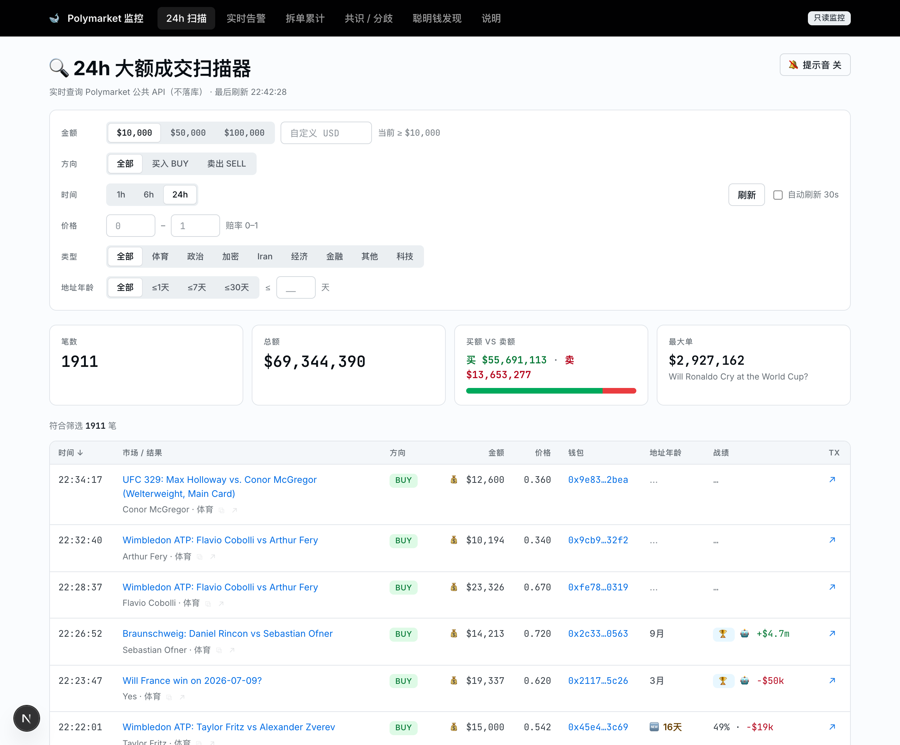
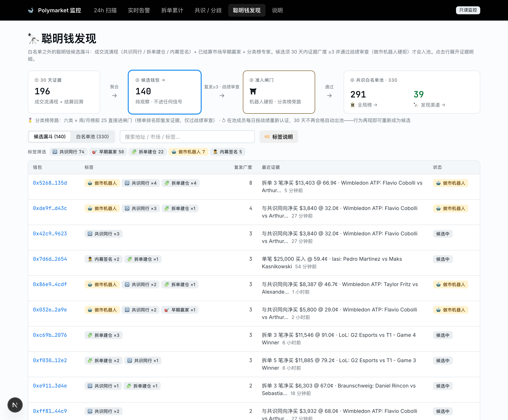
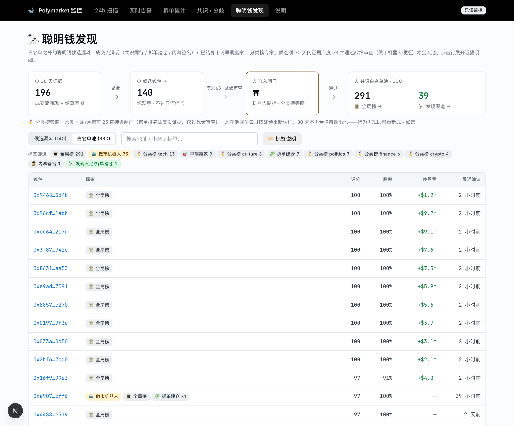
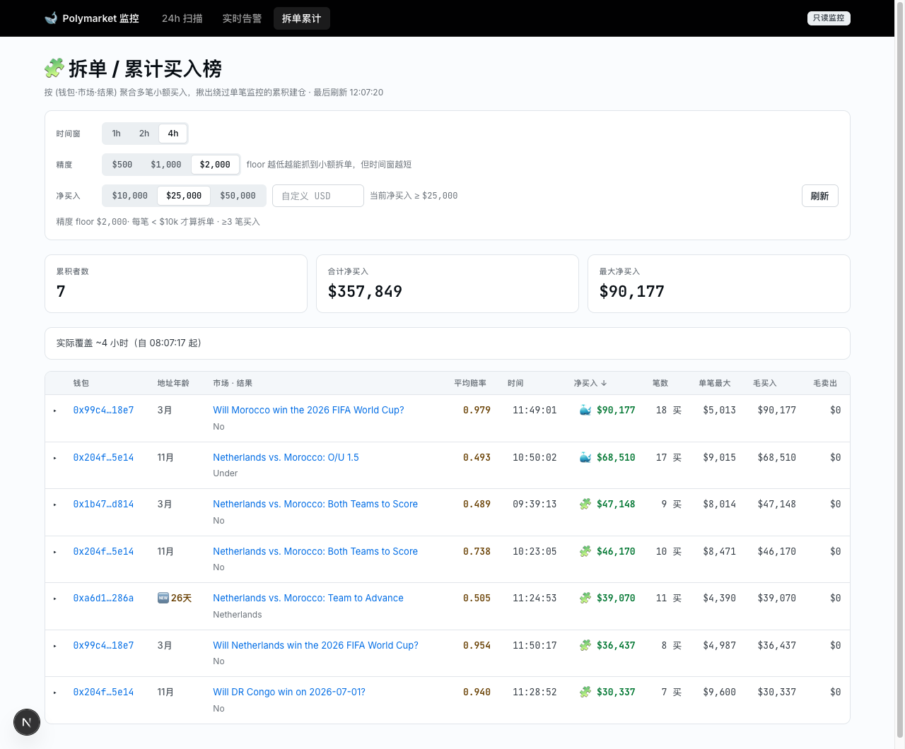
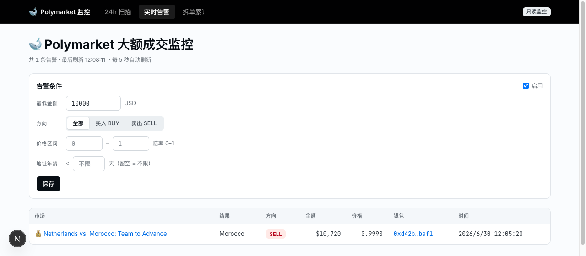

<div align="center">

# 🐳 Polymarket WhaleWatch

**A 7×24 monitor for large fills, split-buy accumulation, fresh-wallet activity and smart-money consensus on [Polymarket](https://polymarket.com) — with a validation loop that grades its own signals, and a public record of how badly some of them did.**

[](https://github.com/kydlikebtc/polymarket-whalewatch/actions/workflows/ci.yml)
[](https://www.typescriptlang.org/)
[](https://nextjs.org/)
[](https://nodejs.org/)
[](https://www.sqlite.org/)
[](https://t.me/Polymarket_WhaleWatch)
[](LICENSE)
[](https://github.com/kydlikebtc/polymarket-whalewatch/commits/main)

**English** · [中文](README.zh-CN.md)



<sub>The 24h scanner with the amount floor at <code>$10,000</code> — 1,911 matching fills across markets, each row carrying a live address-age badge (<code>🆕</code> flags fresh wallets, some only days old), settled track record, and per-row odds. Raise the floor, or layer on the insider-hunt combo (price <code>0.5–0.9</code> + address age <code>≤7天</code>), to collapse the firehose. <em>Screenshot captured 2026-07-08; the top bar has since been reorganised into two direct links plus three dropdown groups, and a 中/EN toggle added.</em></sub>

</div>

---

A whale on Polymarket rarely announces themselves. They split a big position into many small orders, use freshly-created wallets, and buy at favorable odds. **WhaleWatch surfaces exactly that** — a worker that pushes large fills to Telegram within seconds, a dashboard for hunting the patterns single-trade alerts miss, and a paper-trading ledger that keeps score in public.

> ⚠️ **Research and monitoring tool only.** It reads **public** Polymarket data — no authentication, no keys, no trading, no custody of funds. Nothing here is financial advice. Read [What we actually know](#-what-we-actually-know--and-what-we-dont) before you treat any signal as tradeable.

---

## ✨ At a glance

|     | Capability                 | What it catches                                                                    |
| :-: | :------------------------- | :--------------------------------------------------------------------------------- |
| 🔔  | **Large-trade alerts**     | Big executed fills, pushed to Telegram in seconds, tiered by USD size              |
| 🧩  | **Split-buy detection**    | Positions built from many sub-threshold orders — invisible to single-fill monitors |
| 🆕  | **Fresh-wallet flagging**  | Verified address lifespan + new-wallet badges on every row                         |
| 🎯  | **Insider-hunt filters**   | New wallet **＋** favorable odds **＋** pre-settlement rush                        |
| 🏆  | **Smart-money whitelist**  | Auto-seeded daily from the official profit leaderboards, 🏆-tagged live            |
| 🔭  | **Discovery channels**     | Skilled-but-small wallets the boards structurally miss, behind an admission gate   |
| 🔥  | **Consensus detection**    | ≥N whitelist wallets independently buying the SAME outcome                         |
| ⚖️  | **Disagreement detection** | Smart money split across OPPOSING outcomes — a quality-weighted balance            |
| 📈  | **Track records**          | Settled win-rate · authoritative net PnL on every wallet, plus a full dossier      |
| 📐  | **Validation loop**        | 1h/24h follow-through + settlement result on **every** alert it fired              |
| 🧾  | **Strategy centre**        | 19 paper strategies incl. 6 reverse controls, executed against real order books    |
| 📜  | **Public scorecard**       | Signals actually published, hashed into a daily append-only digest chain           |
| 🔌  | **Signals API**            | Machine feed with realtime/delayed tiers, per-key scoping, HMAC webhooks           |
|  𝕏  | **Auto-broadcast**         | Whale fills, consensus, pre-game roundups and a weekly report card to X            |
| 🩺  | **Ops hardening**          | Read-only public guard, rate limits, daily snapshots, dead-man's switch            |

---

## 🚀 What it does

### Layer 1 — the firehose, made searchable

- **24h scanner** (`/`) — every large fill in a rolling window. Filter by **amount**, **side**, **window** (1h/6h/24h), **price band**, **address age**, and **event category** (sports drilled down to league level, e.g. `体育·NBA`). Filters apply client-side, so switching them is instant; the trade feed itself is never archived.
- **Split-buy accumulation board** (`/accumulation`) — aggregates trades by `(wallet, market, outcome)` and ranks by **net buy-in**, catching wallets that build a large position through many sub-threshold orders. Every counted fill is below the single-fill alert threshold, so nothing double-counts against an alert that already fired.
- **Alert engine + history** (`/alerts`) — the worker records every match to SQLite and optionally pushes it to Telegram. Defaults are calibrated, not guessed: 28.6% of raw alerts landed at a price ≥0.90 — settlement-sweep fills on near-certain outcomes carrying almost no information — so `maxPrice` defaults to `0.95` to keep that tail out; and a single wallet re-firing on the same market accounted for 14.2% of all pushes, so a 30-minute per-wallet-per-market cooldown folds them.

### Layer 2 — who is worth watching

- **Smart-money whitelist** — seeded daily from the official profit leaderboards (WEEK/MONTH/ALL merged), enriched with a settled track record, and scored 0–100 on an explainable split (profit 40 + capital efficiency 30 + win rate 30). Market-maker bots (≥1000 markets traded) are labelled 🤖 rather than quietly counted as skill.
- **Discovery channels** (`/discovery`) — the leaderboards rank by **size**, so they structurally miss skilled-but-small wallets. Three channels widen the funnel — firehose emergence (consensus echo · clean splitter · insider signature), early winners in freshly-settled markets, and category-board specialists — and every candidate must clear the same **admission gate** on track record: a settled win rate ≥55% over ≥10 markets **with positive net PnL**, _or_ ROI ≥5% over ≥5 settled markets — deliberately not the 0–100 score, whose profit axis would re-import the size bias. Wallets surfaced from the firehose and early-winner channels must additionally recur across ≥3 distinct markets within 30 days before they are even evaluated; category-board specialists arrive pre-filtered by their own board and go straight to the track-record gate. Membership ages out after 30 days without re-qualifying.
- **Wallet dossier** (`/wallet/<address>`) — current holdings, verified address age, settled win rate / ROI / authoritative net PnL, odds-band histogram, category focus, split-buy tendency, idle on-chain cash, and this tool's own alert history for that wallet.

### Layer 3 — consensus, disagreement, and keeping score

- **Consensus** (`/consensus`) — a 5-minute loop scans a 6h window and fires `🔥 聪明钱共识` when ≥N whitelist wallets each net-buy ≥$X of the same outcome, alerting only on **formation and escalation**, never on repeats.
- **Disagreement** — when smart money piles into _opposing_ outcomes, the naive view reports two contradictory "consensuses". Disagreement detection collapses that into one honest signal: a **quality-weighted balance** (net buy × wallet score) that leans 一边倒 or 势均力敌. Same-wallet-both-sides hedgers are dropped as fake opposition, and the two states are **mutually exclusive** — a contested market can never masquerade as consensus.
- **Validation loop** (📐) — every fired alert gets its 1h/24h price follow-through and final settlement result backfilled on a 10-minute cadence, whether or not anyone looked at it. Confidence intervals are computed **per market, not per alert**, because many alerts in one market are copies of a single random outcome.
- **Strategy centre** (`/follow`) — 19 paper strategies across 6 detector families, including **6 reverse controls** that take the opposite side of the same signal. Entry uses a real CLOB order-book snapshot walked level by level, so modelled slippage is execution cost rather than a guess, and protocol taker fees are charged (Polymarket is _not_ fee-free: 72 of the top 100 markets have fees enabled, covering 57.8% of 24h volume). Zero real capital, at every step.
- **Public scorecard** (`/record`) — only counts signals that were actually **published** through a delivery channel, not the full paper history. Each UTC day of published signals is hashed into an append-only digest chain posted to the public Telegram channel, so the record cannot be quietly edited after the fact.

### Layer 4 — getting signals out

- **Telegram** — tiered large-fill alerts enriched with market context (`占24h量 18% · 流动性 $229k · 距结算 5h`), consensus pushes, a daily 🩺 self-check, and an interactive bot: DM it a market link and it replies with a signal card. Delivery targets are managed in the console, with a paid realtime channel and a public delayed channel carrying the _same fields_ — only the delay differs.
- **Signals API** (`/api/signals`) — a machine feed serving only already-persisted state, so consumer traffic can never eat into the engine's upstream budget. Keys are issued per subscriber (stored as sha256, revocable individually), scoped to signal types server-side, and tiered `realtime` / `delayed`. Failures degrade to a **structurally complete empty feed flagged unhealthy**, so a consumer can never mistake an outage for a quiet day. Contract: [`docs/api-access.md`](docs/api-access.md), rendered in-app at `/api-docs`.
- **Webhooks** — HMAC-signed (`X-Signature: sha256=…`) push for realtime-tier keys, with 4xx treated as permanent failure and 5xx retried.
- **𝕏 auto-broadcast** — whale fills, consensus, pre-game roundups, a Monday report-card image, and self-replies posting the settled result of earlier posts (wins _and_ losses). The `alerts` table doubles as the post queue, so an X outage can never touch the Telegram path.

### Layer 5 — running it 7×24

- **Public read-only guard** — under `NODE_ENV=production` the dashboard is read-only for visitors: writes require `ADMIN_TOKEN`, and expensive fan-out routes are rate-limited in _upstream requests_ rather than HTTP requests (one wallet-stats lookup can cost ~42 upstream calls). Override with `PUBLIC_READONLY=1|0`.
- **Operations console** (`/manage`) — token-gated _before render_: until the token verifies, the page shows nothing but the input box, because even the tab labels leak operational structure. Behind it: alert rules, delivery targets, engine health, API keys, and X accounts.
- **Public status page** (`/status`) — per-loop heartbeats with plain-language consequences ("what you'll stop seeing"). Deliberately kept out of the site nav: a green light does not deserve a slot on a trader's main path.
- **Durability** — daily SQLite online backup (WAL-safe, newest 7 kept), `GET /api/health` returning 503 the moment any loop stops beating (wired to the Compose healthcheck), and an optional `HEALTHCHECK_PING_URL` dead-man's switch that alerts you through a channel independent of this host.

---

## 🧪 What we actually know — and what we don't

Most monitoring tools show you signals and let you assume they work. This one ran the audit and publishes the result, including the parts that hurt.

**The audit.** [`scripts/edge-audit.ts`](scripts/edge-audit.ts) re-scores every settled alert under three corrections, any one of which flips the conclusion on the same data:

1. **Price calibration** — `edge = P(won) − implied probability`. Without it you are measuring who bought safer tickets, not who was smarter (old wallets averaged 0.708, new wallets 0.577).
2. **Fees** — charged with the same `rate × p × (1−p)` formula the app uses. About 1.2 points at mid-range prices, enough to turn any thin edge into an illusion.
3. **Market clustering** — many alerts in one market share a single settlement, so they are N copies of one random event. Ignoring this understates the error bar by ~1.9×.

**What it found**, as of the 2026-08-18 run:

- **Zero of 60 tested groupings survive Bonferroni correction** (critical |z| = 3.34). Full-sample baseline net edge: `−0.87 ± 3.04` — not significant.
- **"Bigger fill = smarter money" is refuted.** All 7 size tiers show no edge, and the `$200k+` tier is the _worst_ (−5.3). This one has no sampling bias; the evidence is strong.
- **"Fresh wallet = insider" is unproven, not refuted** — only 22 alerts across 12 markets, and address age is resolved for just 43% of wallets, non-randomly.
- Post-signal 1h price reaction predicts settlement strongly, but that is **hindsight**: chasing at the actual 1h price scores −3.9, not significant. No tradeable directional edge was found.

**The strategy centre agrees.** Recorded live paper performance (2026-08-13) for six tiers, the three size-driven ones first: 巨鲸 37% / −33.9% · 超级巨鲸 40% / −29.8% · 巨鲸精英 10% / −82% — then 分歧解除 33% / −32.7% · 高分独狼 0% / −100% · 早期赢家跟投 48% / −18.7%, which key off disagreement resolution, wallet score and early-winner status rather than fill size. That is why 6 **reverse control** tiers exist — same detector, same parameters, opposite side — and why 逆势少数边 (+38.9%) is kept as the counter-example rather than quietly dropped.

**The limitation that outranks every number above.** The dataset is **10 effective trading days, not 52**: 95% of it lands in a six-day window in late June 2026, 78% is sports (many "distinct markets" are different lines on the same match), and there is a **43-day outage from 2026-06-30 to 2026-08-12** during which nothing was recorded. The stall alarm that would have caught it was built but not yet deployed. Any hit-rate you read on the site rests on that base.

**What this means for you.** Treat this as an instrument for _finding things to look at_, not a source of trade signals. The validation loop works; what it lacks is enough validated sample. Thresholds will be re-derived only after 30 real trading days of uninterrupted data.

---

## ⚡ Quick start

### Production (the default) — Docker Compose

This is a 7×24 monitor: signals fire around the clock, the validation statistics assume no blind windows, and — as the section above shows — a coverage gap silently poisons months of conclusions. **The canonical deployment is a small always-on server** (any $5 VPS) running the bundled Compose setup: dashboard + embedded engine in one container, SQLite on a named volume, `restart: unless-stopped`.

```bash
git clone https://github.com/kydlikebtc/polymarket-whalewatch && cd polymarket-whalewatch
cp .env.example .env       # optional: add TELEGRAM_BOT_TOKEN / TELEGRAM_CHANNEL_ID
docker compose up -d --build
# dashboard → http://<server>:61001  (host port set in docker-compose.yml)
docker compose logs -f     # engine heartbeat: [engine] starting · [consensus] window …
```

Set `ADMIN_TOKEN` in `.env` before exposing the port publicly — without it, remote writes are disabled entirely, which is safe but leaves you unable to manage the instance from the browser.

### Local development

Requirements: **Node 22** (what the Docker image builds and ships on; `package.json` declares no `engines` floor, and older majors are untested).

```bash
npm install

npm run dev            # dashboard + embedded engine → http://localhost:3000
npm run test           # 1346 tests across 105 files, no network, ~2s
npm run typecheck      # tsc --noEmit
npm run worker         # optional: run the engine as a standalone process instead

npx tsx scripts/dry-run.ts     # zero-credential live smoke test of the whole pipeline
npx tsx scripts/edge-audit.ts  # re-run the three-layer edge audit against your own db
```

### Enable Telegram alerts

```bash
# in .env:
#   TELEGRAM_BOT_TOKEN=...               (from @BotFather)
#   TELEGRAM_CHANNEL_ID=@yourchannel     (bot must be an admin of the channel)

npx tsx scripts/test-telegram.ts   # send a test message
```

Leave both blank to run in record-only mode — matches still land in SQLite and on `/alerts`.

### Enable 𝕏 auto-broadcast (optional)

Only the **app-level** key pair is required; the posting account is authorized separately through `/manage → 𝕏 播报账号` (3-legged OAuth, multiple accounts, one active at a time, switching takes effect within a cycle without a restart). Register `<PUBLIC_URL>/api/x-callback` as the app's callback URI first.

```bash
# in .env:
#   X_API_KEY=...             # developer.x.com app (pay-per-use plan), OAuth 1.0a
#   X_API_SECRET=...
#   X_MONTHLY_BUDGET_USD=15   # local fail-closed spend fuse (default 15)
#   X_MIN_TRADE_USD=50000     # whale-post floor — X quota is scarce, Telegram isn't
#   X_OG_ORIGIN=http://127.0.0.1:3000   # where the worker fetches /api/og/weekly
```

2026 pay-per-use pricing: $0.015 per text post, $0.20 per link post (only the weekly report card carries a link), so $15/month ≈ 33 posts/day. Daily caps: whale 20, pre-game 3, settled self-replies 5; consensus is naturally rare and uncapped. Set the same cap in the X developer dashboard as a platform-side backstop.

Every environment variable is documented in [`.env.example`](.env.example).

---

## 🧠 How it works

- **Upstream** — Polymarket Data API (`data-api.polymarket.com`), Gamma API (`gamma-api.polymarket.com`), CLOB price history _and_ order-book snapshots (`clob.polymarket.com`), the user-PnL API (`user-pnl-api.polymarket.com`), and public Polygon RPC for on-chain idle balances. No auth, no keys, no writes.
- **Scanner fetch strategy** — the API times out (HTTP 408, ~5.75s) on expensive high-`filterAmount` queries, so the dashboard always fetches at a **low floor** and applies the higher amount / side / price / age filters client-side.
- **Address age** — one `/activity?sortBy=TIMESTAMP&sortDirection=ASC` probe yields a _candidate_ first-activity timestamp, which is then verified by walking backwards (up to 8 probes) before it is trusted. Only verified timestamps are cached permanently; unverified ones are retried.
- **Net PnL (authoritative)** — the last point of the cumulative curve from `user-pnl?interval=1m&fidelity=1d`. This is the exact figure Polymarket shows on a profile, and it correctly **nets** held-to-zero losers. It replaced a `/closed-positions` sum that was sorted by `realizedPnl` DESC and row-capped, feeding high-volume wallets a winners-only slice (one live sample read +$22.96M when the true net was −$6.14M).
- **Win rate / ROI** — from `/closed-positions` (`totalBought` is **shares**, so cost basis is `totalBought × avgPrice`), merged with resolved-but-unclosed losers from `/positions` to fix survivorship. Both paginate to 20 pages of 50; beyond that the record is flagged `truncated` and win rate / ROI are **withheld entirely** (rendered as `—`) rather than shown as a wrong number — the true values are unrecoverable from a capped, PnL-sorted slice, so an honest "unknown" beats a confident lie.
- **Leaderboard quirks (verified live)** — `rank` comes back as a string, pages clamp at 50 rows, and deep offsets silently re-serve the same rows, so wallet-dedup is the only reliable termination condition.
- **Validation** — past prices are immutable, so follow-through is fetched once and cached permanently; settlements come from Gamma closed-market metadata, which never expires.
- **Worker ≠ dashboard** — the worker is the _stateful, alerting_ path (writes SQLite, pushes Telegram/X); the dashboard is the _stateless, exploratory_ path (reads the live API). They are decoupled through SQLite. In the Docker image the worker runs embedded in the Next.js process; `npm run worker` runs it standalone.

Full subsystem walkthrough, data-flow diagram, request paths and design constraints: **[ARCHITECTURE.md](ARCHITECTURE.md)**.

---

## 🗂️ Repository layout

```
lib/            90 modules — upstream clients, alert engine, smart-money scoring,
                consensus/disagreement, strategy simulation, validation stats,
                signal bus & delivery, Telegram/X publishing, ops health
  i18n/         bilingual dictionaries + two test gates (coverage, term conflicts)
worker/         the engine — 8 loops, embedded in Next or standalone
app/            Next.js dashboard: 14 pages, 27 API route handlers
scripts/        dry-run · edge-audit · watch · test-telegram · issue-key
docs/           API contracts, 24 design documents, screenshots  → docs/README.md
```

Stack: TypeScript · Next.js 16 · React 19 · better-sqlite3 · zod · vitest. 1346 tests across 105 files, no network and no fixture server — nearly every module is a pure core with I/O injected.

State lives in one SQLite file (31 tables). Most of it is **rebuildable cache** — delete it and prices, ages and market metadata refill themselves. Some of it is **not**: the alert ledger, published-signal records, issued API keys (stored only as sha256), authorized X tokens and delivery targets are gone for good. Back it up; the engine already snapshots daily, but only off-host copies survive losing the host.

---

## 🗺️ Roadmap

- [x] Large-trade Telegram alerts, tiered and context-enriched
- [x] 24h scanner with amount / side / window / price / address-age / category filters
- [x] Split-buy accumulation detection
- [x] Verified wallet-age annotation with fresh-address badges
- [x] Smart-money whitelist — daily leaderboard seed → settled scoring → live 🏆 tagging
- [x] Consensus detection, and disagreement as a mutually-exclusive quality-weighted balance
- [x] Discovery channels behind a recurrence + track-record admission gate
- [x] Wallet dossier with live holdings, odds-band histogram and on-chain idle cash
- [x] Validation loop: 1h/24h follow-through + settlement backfill on every alert
- [x] Strategy centre: 19 tiers, order-book execution modelling, protocol fees, 6 reverse controls
- [x] Event sub-categories (sports drilled to league level)
- [x] Deep analysis panel + track×strategy edge matrix + exit counterfactuals
- [x] Signal bus, subscriber API keys, HMAC webhooks, daily digest chain, public scorecard
- [x] 𝕏 auto-broadcast with settled self-replies and a weekly report card
- [x] Bilingual UI (中/EN) with coverage and term-conflict test gates
- [x] Ops hardening: read-only guard, rate limits, daily snapshots, dead-man's switch
- [x] Three-layer edge audit codified as a re-runnable script
- [x] New outlets: MCP server (`npm run mcp`), embeddable record/status cards (`/embed/*`), public CSV dataset (CC BY 4.0)
- [ ] **30 uninterrupted trading days of data**, then re-derive every threshold — the blocker for everything below
- [ ] Channel effectiveness scorecard (per-source forward hit-rate; the `source` column is the groundwork)
- [ ] Accumulation → Telegram alerts (stateful, tier-crossing dedup)
- [ ] Event-level accumulation across correlated sub-markets

---

## 📸 More views

<table>
<tr>
<td width="50%" valign="top">

<br><sub><b>Discovery funnel (<code>/discovery</code>)</b> — 30-day evidence → candidate wallets → admission gate → whitelist pool, with real counts. Rows carry behaviour tags (🔁 echo · 🧩 splitter · 🕵️ insider · 🎯 early winner) and expand into the full evidence detail. <em>2026-07-08.</em></sub>
</td>
<td width="50%" valign="top">

<br><sub><b>Whitelist pool, in full</b> — every member with source attribution, derived behaviour tags, score / settled win-rate / net PnL. Honest by construction: market-maker bots are labelled 🤖 rather than counted as skill. <em>2026-07-08.</em></sub>
</td>
</tr>
<tr>
<td width="50%" valign="top">

<br><sub><b>Split-buy accumulation board</b> — wallets ranked by <b>net buy-in</b>, with size-weighted average odds and address age. Expand any row to see the sub-threshold orders that built the position. <em>2026-06-30.</em></sub>
</td>
<td width="50%" valign="top">

<br><sub><b>Alert history + validation</b> — every fired alert with its 1h/24h follow-through and settlement result. <em>2026-06-30; alert-rule editing has since moved to <code>/manage</code>, and the confidence interval is now computed per market.</em></sub>
</td>
</tr>
</table>

---

## 📚 Documentation

| Document                                   | What's in it                                                                |
| ------------------------------------------ | --------------------------------------------------------------------------- |
| [ARCHITECTURE.md](ARCHITECTURE.md)         | Data flow, all subsystems, worker loops, request paths, design constraints  |
| [CHANGELOG.md](CHANGELOG.md)               | What shipped when — including the corrections that changed reported numbers |
| [CONTRIBUTING.md](CONTRIBUTING.md)         | Dev commands, test conventions, commit format, what is out of scope         |
| [SECURITY.md](SECURITY.md)                 | Private reporting channel, and which secrets live in the SQLite file        |
| [docs/README.md](docs/README.md)           | Index of 24 design documents, screenshots, and the two API contracts        |
| [docs/api-access.md](docs/api-access.md)   | Subscriber-facing Signals API reference (also served in-app at `/api-docs`) |
| [docs/signals-api.md](docs/signals-api.md) | Internal contract for `/api/signals` — trade-offs and definition history    |

---

## 📄 License

Source-available for **personal and research use** — read it, audit it, learn from it, self-host it. Commercial use and redistribution are not granted; see [LICENSE](LICENSE). This is deliberately not an OSI-approved open source license, so GitHub displays it as "Other".

<div align="center">
<sub>Not affiliated with Polymarket · Public data only · No trading, no custody, not financial advice</sub>
</div>
