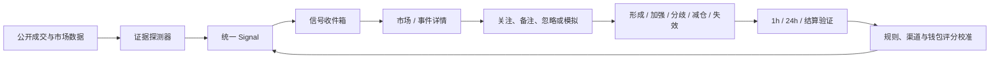

# Polymarket WhaleWatch 战略规划与迭代总纲

> 文档状态：提案版（Living Document）  
> 制定日期：2026-07-10  
> 规划周期：未来 12 个月  
> 适用范围：产品、数据、算法、告警、前端、部署与商业化决策  
> 上位资料：[项目 README](../../README.md) · [原始设计](2026-06-23-polymarket-monitor-design.md) · [实现计划](2026-06-23-polymarket-monitor-implementation.md)

---

## 1. 战略结论

WhaleWatch 已经不只是“大额成交提醒器”，而是具备以下闭环的研究产品：

`公开成交流 → 异常行为识别 → 聪明钱发现与准入 → 共识/分歧 → 告警 → 1h/24h/结算验证`

下一阶段不应继续平铺更多独立看板或探测器，而应完成三次升级：

1. **从成交升级为信号**：把大单、拆单、新钱包、共识、分歧等证据聚合为统一的市场级信号。
2. **从信号升级为可执行机会**：展示反方证据、订单簿容量、滑点、信号年龄、钱包是否仍持仓等客观上下文。
3. **从机会升级为可验证策略**：通过不可变快照、全量结果回填、历史归档和样本外回测，证明哪些信号在什么条件下存在 edge。

目标产品定位：

> 不只是告诉用户谁下了大单，而是证明这些资金是否彼此独立、现在是否仍可执行，以及历史上是否真的存在 edge。

---

## 2. 当前基础与核心缺口

### 2.1 已形成的产品资产

- 大额成交扫描与 Telegram 实时推送。
- 拆单累计、对冲与做市嫌疑识别。
- 地址年龄、新钱包标记与钱包完整档案。
- Leaderboard、分类榜和三类发现渠道组成的聪明钱漏斗。
- 准入闸门、来源标签和 30 天动态白名单。
- 聪明钱共识、分歧及当前持仓对照。
- 1h、24h 和最终结算验证。
- 统一术语表、URL 可分享筛选和较完善的异常/截断提示。
- SQLite 持久化去重、跨进程 claim、API 重试和较高的单元测试覆盖。

### 2.2 当前最大的产品缺口

- 多个一级页面按技术模块平铺，同一市场的证据需要用户自行拼接。
- 缺少统一市场详情、信号状态、关注列表、研究笔记和后续跟踪。
- 只有一套全局告警条件，无法保存多个策略、单独评估效果或控制噪声。
- 验证能力仍附着在最近告警列表上，尚未形成独立效果分析中心。
- “仍可跟”主要依据价格距离，未覆盖订单簿容量、滑点、信号时效和减仓状态。

### 2.3 必须优先偿还的可信度债务

这些事项属于 P0，不参与普通功能优先级竞争：

1. **统计口径一致性**：24h 页的价格、类别和地址年龄为客户端二次筛选，但顶部 KPI 仍可能使用筛选前统计。
2. **净仓位口径**：累计、共识、分歧和发现逻辑使用 `buyUsd - sellUsd` 近似净买入；应改为净股数与当前方向敞口，现金流和仓位分开表达。
3. **共识/分歧一致性**：网页已互斥，但 Telegram worker 仍可能对同一市场的对立结果分别推送“共识”。
4. **结果回填完整性**：告警结果主要由页面按需触发，无法保证历史信号全量成熟和回填。
5. **运行状态可见性**：缺少 worker heartbeat、最后成功轮询、覆盖窗口、截断率、上游错误率、队列积压和日任务状态。
6. **采集与投递解耦**：Telegram 串行发送会拖慢采集循环，需要 durable outbox 和独立投递消费者。

---

## 3. 战略目标与北极星指标

### 3.1 北极星指标

**每周被用户纳入研究、告警时仍具可执行容量、且事后完成验证的高质量信号数。**

一个信号只有同时满足以下条件才计入：

- 用户打开、关注、保存或明确标注为“纳入研究”。
- 告警时对用户设定的参考资金量仍有可接受的订单簿容量。
- 后续至少获得一个成熟 markout 或最终结算结果。
- 信号来源、规则版本、模型版本和当时数据覆盖均可追溯。

不把以下指标作为北极星：

- 告警数量：会激励制造噪声。
- 单纯 DAU：不代表用户获得了研究价值。
- 裸胜率：高赔率买入天然拥有较高基础胜率。
- 未考虑费用与滑点的理论收益。

### 3.2 四类配套指标

| 维度     | 核心指标                                                                                       |
| -------- | ---------------------------------------------------------------------------------------------- |
| 可靠性   | p50/p95 成交→检测→送达延迟、覆盖率、截断率、重复率、投递成功率、worker/API uptime              |
| 信号质量 | 1h/24h markout、入场赔率调整后的超额表现、结算 ROI、Brier/校准误差、最大不利波动、仍可执行比例 |
| 用户价值 | 首次获得有效信号时间、信号打开/处理/关注率、规则激活率、mute/误报率、周复盘完成率、D7/D30 留存 |
| 数据壁垒 | 已验证信号数、历史覆盖天数、长期标签钱包数、可信钱包簇数、事件关系覆盖率、用户反馈标签密度     |

所有效果指标必须同时展示：

- 成熟样本数与未成熟样本数。
- 置信区间或贝叶斯收缩结果。
- 类别、赔率带、流动性和时间窗分层。
- 数据覆盖是否完整，是否只是下界。

---

## 4. 产品与数据的目标形态

### 4.1 目标用户工作流

### 4.2 统一信号模型

新增 `Signal` 作为所有探测器的共同上层实体，而不是让每种探测器直接产生互不关联的 UI 行和通知。

建议最小模型：

| 实体             | 关键内容                                                             |
| ---------------- | -------------------------------------------------------------------- |
| `TradeFact`      | 标准化成交事实、去重键、采集时间、来源与覆盖水位                     |
| `Signal`         | signal_id、市场/事件/结果、类型、首次/最近检测时间、状态、强度、版本 |
| `SignalEvidence` | 大单、拆单、共识、新钱包、分歧、减仓等支持或反方证据                 |
| `SignalSnapshot` | 当时价格、订单簿、流动性、距结算、来源、钱包评分、规则与模型版本     |
| `SignalOutcome`  | 多时间点 markout、MFE/MAE、结算结果、费用/滑点调整收益               |
| `AlertRule`      | 多条规则、模板、作用域、路由、冷却、优先级、版本                     |
| `Watch/Feedback` | 用户关注状态、备注、误报原因、研究结论和处理时间                     |

### 4.3 信号生命周期

建议统一状态：

`new → strengthening → contested/crowded → weakening → exited/invalidated → resolved`

状态变化而非重复成交应成为通知的主要单位：

- 首次形成：第一次满足规则。
- 加强：新增独立钱包、净仓位跨阶、反方消失或执行容量改善。
- 拥挤/已跑：价格显著偏离入场区，或盘口容量不足。
- 分歧：相反结果出现足够独立聪明钱。
- 减仓/退出：核心钱包降低或清空当前敞口。
- 反转/失效：钱包转向、市场条件变化或证据不再成立。
- 结算：完成最终验证并进入复盘。

### 4.4 可解释信号评分

评分只负责排序，不输出黑箱“买/卖建议”。建议由可展开的分量构成：

- 钱包或来源的历史 alpha。
- 钱包之间的独立性。
- 相对市场基线的异常程度。
- 成交量、流动性和价格冲击。
- 订单簿可执行容量与预计滑点。
- 信号新鲜度和距结算时间。
- 反向聪明钱、对冲、做市和拥挤惩罚。

任何总分必须允许用户查看组成、数据缺失项和不确定性。

---

## 5. 分阶段路线图

### Phase 0：可信运行地基（0–2 个 Sprint）

#### 目标

让系统能够回答：“数据是否完整、检测是否正确、通知是否送达、历史结果是否全部回填？”

#### 交付物

##### P0.1 统计与净仓位修正

- 24h 页所有 KPI 从最终筛选集重算。
- 类别等完整筛选状态写入 URL。
- 所有方向检测统一记录：
  - `buyShares`
  - `sellShares`
  - `netShares`
  - `buyCostUsd`
  - `sellProceedsUsd`
  - `exposureUsd = netShares × currentPrice`
- 重构累计、共识、分歧、echo 和 hedger/MM 判断。
- UI 明确区分“窗口现金流”“窗口净股数”“当前真实持仓”。

验收门槛：

- 等股数买入后全部卖出时，净仓位必须为 0，与成交价格无关。
- 所有旧用例迁移后通过，新增长短仓、部分卖出和跨价位测试。
- 列表与 KPI 在任意组合筛选下保持同一口径。

##### P0.2 共识/分歧统一管线

- Worker 与网页共用同一市场级分类结果。
- contested 市场不得推送单向共识。
- 增加分歧形成、升级和解除事件。
- 同一市场所有状态使用同一 `signal_id`。

验收门槛：

- 任一时间窗内，一个市场只能处于共识、分歧或无信号之一。
- 页面、数据库和 Telegram 的分类结果一致。

##### P0.3 后台全量结果回填

- 独立 job 扫描所有需要成熟的信号。
- 记录 5m/15m/1h/6h/24h/结算结果，可按成本控制分批上线。
- 结果计算不依赖用户打开页面。
- 保存信号时点的价格、方向、规则、来源和覆盖快照。

验收门槛：

- 达到时间条件的历史信号在 SLA 内完成回填。
- 重跑任务幂等，已结算结果不可被后续刷新改变。

##### P0.4 运行健康中心

- `/api/health` 与顶部状态入口。
- 展示各循环 heartbeat、上次成功、连续失败、下一次计划运行。
- 展示交易覆盖起点、分页截断、上游延迟、429/408、缓存命中率。
- 展示 Telegram 队列长度、投递成功/失败和最后错误。
- 对“无数据”和“数据源失败”使用不同状态码与 UI。

##### P0.5 Durable Outbox

- 采集与信号判定先持久化。
- Telegram 由独立消费者异步发送。
- 记录 `queued/sending/sent/retry/permanent_failed`。
- 支持指数退避、死信和人工重放。

#### Phase Gate

只有满足以下条件才进入 Phase 1：

- 连续 7 天无静默停机。
- 信号结果回填覆盖率 ≥ 99%。
- contested 市场矛盾推送为 0。
- 重复告警率和未解释的数据截断均可观测。

---

### Phase 1：信号操作台 MVP（第 3–8 周）

#### 目标

把“多个强看板”收拢成“发现 → 判断 → 跟踪 → 复盘”的连续工作流。

#### 交付物

##### P1.1 统一信号收件箱

- 按市场/事件/结果聚合全部信号类型。
- 支持优先级、最新变化、状态、已读、关注和忽略。
- 展示支持证据、反方证据、当前价格、距结算和数据完整度。
- 默认按客观信号优先级排序，不按成交金额单一排序。
- 保留原始大单、累计、共识和发现页作为深入分析视图。

##### P1.2 市场/事件详情页

- 价格时间线叠加大单、拆单、共识、分歧与状态变化。
- 各结果聪明钱流向、当前持仓和 Top holders。
- 流动性、成交量、开放兴趣、价差、盘口深度和距结算。
- 同事件相关子市场及重复/冲突暴露。
- 所有现有表格统一深链到该页面。

##### P1.3 多规则告警

- 支持多条规则独立启停、命名、优先级和路由。
- 首批模板：
  - 鲸鱼大单
  - 新钱包异常流
  - 聪明钱共识
  - 临近结算异常流
  - 拆单累计升级
  - 钱包减仓/退出/反转
- 保存前试运行并估算近 24h 命中量。
- 每条规则显示自己的告警数、mute 率和历史效果。

##### P1.4 关注列表与研究状态

- 关注市场、钱包、类别和信号。
- 状态：待研究、观察中、已失效、已结算。
- 支持备注、忽略原因和人工置信度。
- Telegram 深链回具体 signal，而不是只跳到通用页面。

##### P1.5 状态化通知与摘要

- 拆单净仓位跨越阈值时只推升级事件。
- 共识新增独立钱包、转为分歧、核心钱包退出时推状态变化。
- 支持静默时段、小时摘要、晨报和每周复盘。
- 同一事件多条证据优先折叠为一条摘要。

#### Phase Gate

- 50% 以上的有效告警可归并到统一 signal。
- 重复/折叠后的人均每日告警量下降，但信号打开率上升。
- 至少 30% 的活跃用户使用关注、备注或处理状态。
- 信号收件箱成为主要入口，且不降低原始数据可追溯性。

---

### Phase 2：可验证研究与差异化 Intelligence（第 2–4 月）

#### 目标

从“看起来合理”升级为“历史上经过赔率、费用、滑点和样本量校准”。

#### 交付物

##### P2.1 可选滚动历史归档

- 用户显式选择 7/30/90 天保留期。
- 优先保存标准化成交事实和信号时点快照，不盲目无限归档。
- 设置磁盘预算、自动清理、导出和一键删除。
- 使用 watermark 增量采集，并记录覆盖缺口。

##### P2.2 效果分析中心

- 按类型、来源、类别、赔率带、流动性、地址年龄、距结算和规则版本分组。
- 指标包括：
  - 5m/15m/1h/6h/24h markout
  - MFE/MAE
  - 结算 ROI
  - 入场赔率调整后的 excess return
  - Brier/校准曲线
  - 执行成本调整后收益
- 强制显示样本量、成熟率和置信区间。

##### P2.3 Walk-forward 回测与模拟组合

- 时间切分训练/验证，禁止未来数据泄漏。
- 用户输入预算、单信号仓位、退出规则和滑点假设。
- 使用信号时点可见的订单簿进行模拟成交。
- 输出收益曲线、最大回撤、暴露集中度和相关市场风险。
- 阈值建议只作为可解释建议，不自动修改生产规则。

##### P2.4 聪明钱评分 v2

- 从裸胜率/PnL 升级到：
  - 入场赔率调整后的超额表现
  - 类别专长
  - 时间衰减
  - event 去重
  - 样本收缩与置信区间
  - 回撤与样本外稳定性
- 钱包评分、准入条件和结果都必须版本化。
- Channel alpha 与 wallet alpha 分开计算。

##### P2.5 钱包独立性与关联聚类

- 第一阶段使用：交易同步度、市场重合、金额/价格指纹和 lead-lag。
- 第二阶段可选使用：共同入金来源和链上资金路径。
- 只输出“关联概率/行为相似”，不公开断言真实身份。
- 同簇钱包在共识计算中只计一票或按独立性折扣。

##### P2.6 可执行性评分

- 对参考资金量计算预计成交均价、滑点和可成交容量。
- 纳入 spread、盘口深度、信号年龄、距结算和钱包是否仍持仓。
- 将“仍可跟”改为客观字段：价格距离、可执行容量和数据充分度。
- 市场 WebSocket 用于实时盘口与价格；钱包归因仍使用可验证成交数据。

##### P2.7 类别感知模型

- 体育：区分赛前与滚球，纳入比分、阶段和比赛状态。
- Crypto/股票：对照标的实时价格和短周期市场状态。
- 政治/宏观：后续接入可追溯催化时间线。
- 不同类别使用不同基线、阈值和验证分层。

#### Phase Gate

- 至少一个信号策略在 walk-forward 样本外、费用/滑点调整后仍有稳定正向表现。
- 主要指标同时满足最小样本量和置信区间要求。
- 独立性折扣显著减少伪共识，且人工复核可解释。
- 参考资金量下“仍可执行”的信号比例可稳定追踪。

---

### Phase 3：Hosted、协作与商业化（第 4–6 月）

#### 目标

在信号质量和留存被证明后，将个人研究工具产品化。

#### 交付物

- 用户账户、空间和按用户隔离的规则/关注列表。
- 7×24 托管、备份、恢复和运行 SLA。
- 团队共享信号、备注、负责人、结论和审计轨迹。
- 可脱敏的不可变分享快照与周报导出。
- Webhook/API，之后再按需求增加 Email、Slack、Discord 或 PWA。
- 权限、速率限制、计费、数据保留策略和管理员工具。

#### 商业分层

| 版本              | 核心价值                                                |
| ----------------- | ------------------------------------------------------- |
| OSS / Self-host   | 核心实时监控、可解释逻辑、有限本地留存                  |
| Pro Hosted        | 免运维 7×24、长历史、多规则、摘要、回测和模拟组合       |
| Team / Research   | 协作空间、角色、审计、共享报告、API/Webhook、自定义因子 |
| Data / Enterprise | 标准化历史数据、wallet/event factor API、SLA、私有部署  |

收费依据优先选择：托管、历史深度、席位、API 用量和 SLA。不要按告警条数收费，也不采用收益分成。

#### Phase Gate

- 先与 5–10 个 design partners 验证付费意愿。
- Pro 用户的 D30 留存和规则活跃率达到内部目标。
- 单活跃空间的数据与基础设施成本可持续。
- 多租户权限、备份恢复和审计通过安全检查。

---

### Phase 4：数据平台与可选执行入口（第 6–12 月）

#### 目标

把长期验证数据、钱包关系和事件图谱沉淀为真正的护城河。

#### 数据平台

- 标准化 trade–wallet–market–event–signal–outcome 数据层。
- 因子、规则和模型版本可复现实验。
- 钱包行为图、事件关系图和长期信号回放。
- 研究 API、批量导出、私有部署和 SLA。

#### 可选交易入口

Polymarket 官方 Builder 能力允许订单归属、免 Gas 流程和 Builder fee，但交易能力必须独立立项，不与只读研究功能默认绑定。

只有同时满足以下条件才进入交易功能评审：

- 信号质量与用户留存已稳定至少一个季度。
- 用户明确需求，而非仅由商业化想象驱动。
- 完成安全、密钥、权限、地域限制、合规和责任边界评审。
- 首版只考虑用户主动确认的模拟转真实订单，不做自动跟单或托管资金。

---

## 6. 功能优先级总表

| 优先级 | 功能                      | 用户价值 | 复杂度 | 主要依赖                    |
| ------ | ------------------------- | -------- | ------ | --------------------------- |
| P0     | KPI 口径与净仓位修正      | 极高     | 中     | 现有交易聚合                |
| P0     | Worker 健康中心           | 极高     | 低–中  | config、循环日志            |
| P0     | 共识/分歧统一管线         | 极高     | 中     | consensus、disagreement     |
| P0     | 后台全量 outcome backfill | 极高     | 中     | alertOutcomes、priceHistory |
| P0     | Durable outbox            | 高       | 中     | alerts、Telegram claim      |
| P1     | 统一信号收件箱            | 极高     | 高     | Signal 模型                 |
| P1     | 多规则告警与模板          | 高       | 中–高  | Signal、Rule 模型           |
| P1     | 拆单阶梯与退出/反转告警   | 高       | 中     | 净仓位、状态机              |
| P1     | 市场/事件详情页           | 极高     | 高     | Signal、Gamma、持仓         |
| P1     | 关注列表与研究状态        | 高       | 中     | 用户/本地偏好模型           |
| P2     | 渠道效果中心              | 极高     | 中     | 全量 outcome、快照          |
| P2     | 可选历史归档与回测        | 极高     | 高     | watermark、存储策略         |
| P2     | 订单簿可执行性            | 高       | 中–高  | CLOB WebSocket/REST         |
| P2     | 钱包独立性聚类            | 高       | 高     | 历史成交、链上可选          |
| P2     | Event 级相关市场图谱      | 高       | 高     | eventSlug、Gamma            |
| P3     | Hosted 与团队协作         | 高       | 高     | Auth、Postgres、权限        |
| P3     | API/Webhook               | 高       | 中     | 多租户、速率限制            |
| P4     | 可选交易入口              | 潜在高   | 极高   | PMF、安全、合规             |

---

## 7. 首个六周执行计划

规划以三个两周 Sprint 为单位；如只有一名主要开发者，应优先保证 Phase Gate，不为了日期压缩可信度工作。

### Sprint 1：可信度修复

- 完成 KPI 口径修正和筛选 URL 完整化。
- 完成 netShares/方向敞口模型与全部检测器迁移。
- 统一网页与 worker 的共识/分歧分类。
- 定义 Signal、Snapshot、Outcome 和 Outbox schema/ADR。
- 上线最小 `/api/health` 和状态条。

Sprint 验收：

- 所有现有测试通过，新增仓位与矛盾推送测试。
- 页面、API、Telegram 对同一输入输出一致。
- 健康页能主动暴露 worker 停止或数据覆盖不足。

### Sprint 2：信号与验证地基

- 建立统一 `signal_id` 和状态机。
- 上线后台 outcome backfill。
- 告警写入来源、规则、模型、覆盖和检测时间快照。
- 上线 Telegram outbox。
- 完成拆单累计跨阶告警。

Sprint 验收：

- 页面不打开时，成熟结果仍会自动回填。
- 投递失败不阻塞采集，状态可追踪并可重试。
- 同一累计信号只在形成和升级时推送。

### Sprint 3：工作流 MVP

- 上线统一信号收件箱 MVP。
- 上线市场详情页第一版。
- 支持关注、已读和忽略原因。
- 上线 3–5 个多规则模板和试运行命中估算。
- 上线信号类型/来源的效果中心第一版。

Sprint 验收：

- 用户可从一条信号完成证据查看、市场判断、关注和后续验证。
- 每条信号都能追溯到原始成交、规则和数据覆盖。
- 效果中心不会混入未成熟样本或隐藏样本量。

---

## 8. 研发与发布治理

### 8.1 功能立项规则

新功能必须明确回答以下至少一个问题：

1. 它是否提高数据或投递可信度？
2. 它是否缩短用户判断一个信号所需的时间？
3. 它是否降低误报、重复和不可执行信号？
4. 它是否产生可长期验证的数据资产？
5. 它是否被真实用户持续使用或愿意付费？

不能回答上述问题的功能默认不进入当前季度。

### 8.2 Definition of Done

每个功能完成时必须同时具备：

- 正常、异常、截断、重复和重启路径测试。
- 数据口径、覆盖范围和不确定性说明。
- 指标埋点与健康状态。
- 数据库迁移、回填和回滚方案。
- UI 空态、错误态、加载态和移动端验证。
- glossary/README/运行手册同步更新。
- 规则或模型变更的版本号。

### 8.3 评审节奏

- 每周：可靠性、覆盖缺口、失败任务和告警噪声复盘。
- 每 Sprint：发布指标、用户处理路径和技术债复盘。
- 每月：规则/渠道效果、样本成熟度和 roadmap 调整。
- 每季度：是否进入下一 Phase Gate，以及商业化/交易方向是否继续成立。

---

## 9. 明确不做的事项

在相应 Phase Gate 之前，明确不优先做：

- 自动跟单、托管资金或默认一键交易。
- 黑箱“AI 建议买/卖”；自然语言只允许总结可追溯事实和不确定性。
- 用裸胜率、裸 PnL 或单一 0–100 分数代表真实能力。
- 把“新钱包异常行为”直接描述成内幕事实或公开身份指控。
- 社交喊单广场、公开钱包竞赛或以告警量驱动的增长机制。
- 在信号质量未证明前扩展大量通知渠道、原生移动 App 或多个交易所。
- 使用未来数据调阈值，或只展示最优回测而不做 walk-forward 验证。
- 默认无限归档全部原始数据。
- 过早迁移复杂基础设施；单机阶段先把 schema、任务租约和可观测性做好。

“内幕猎杀”一类产品文案建议逐步改为“新钱包异常流”或“临近结算异常流”，保持研究工具的客观表达。

---

## 10. 长期护城河排序

1. 带不可变时点快照和结算结果的纵向信号数据集。
2. 钱包行为关系图与独立性去重。
3. Event ontology 与相关市场图谱。
4. 可复现的校准、回测和模型版本体系。
5. 用户对信号的处理、误报原因和研究结论反馈。
6. 对公开 API 变化的快速适配和稳定送达能力。

公开 API、阈值列表、单个钱包榜单和页面视觉都容易复制，不应被视为核心壁垒。

---

## 11. 外部能力假设与技术边界

以下能力以 2026-07-10 的 Polymarket 官方文档为准，实施前仍需再次核对 changelog：

- [Market WebSocket](https://docs.polymarket.com/market-data/websocket/market-channel)：订单簿、价格变化、best bid/ask、成交和市场状态。
- [WebSocket Overview](https://docs.polymarket.com/market-data/websocket/overview)：Market、User、Sports 与 RTDS 通道。
- [RTDS](https://docs.polymarket.com/market-data/websocket/rtds)：评论、加密和股票等实时数据。
- [Builder Program](https://docs.polymarket.com/builders/overview)：订单归属与免 Gas builder 流程。
- [Builder Fees](https://docs.polymarket.com/builders/fees)：可选 builder fee 商业化路径。

边界说明：

- Market WebSocket 的公开交易事件不等于完整钱包归因，钱包归因仍需 Data API 或可验证链上数据。
- Sports/RTDS 用于补充上下文和降低误报，不直接构成投资建议。
- Builder 能力存在不等于应该立即加入交易；交易仍受安全、权限、地域和责任边界约束。

---

## 12. 待确认的战略决策

进入 Phase 1 前，需要明确：

- 产品主要服务个人研究者，还是准备发展为多用户 SaaS？
- 默认参考执行资金量使用 $1k、$5k 还是允许用户配置？
- 历史归档是否默认关闭，保留期和磁盘预算是多少？
- Telegram 继续以频道广播为主，还是增加可交互私聊 Bot？
- 首批 design partners 主要来自体育、政治、Crypto 还是全类别研究者？
- 哪些数据和钱包标签可以公开，哪些应只在私有空间展示？

这些选择不阻塞 Phase 0，但会决定 Phase 1 的账户、规则和信息架构设计。

---

## 13. 文档维护规则

- 本文档是战略总纲，不替代每个功能的详细设计和实现计划。
- 每次 Phase Gate 评审后更新状态、指标基线和下一阶段范围。
- 新增重大方向时，应同时写明：用户问题、成功指标、依赖、风险和明确不做的范围。
- 已失效假设不要静默删除，应移入决策记录并说明证据。
- 代码中的 Roadmap、README 和本文件应保持一致，避免对外说明与产品实际能力漂移。
